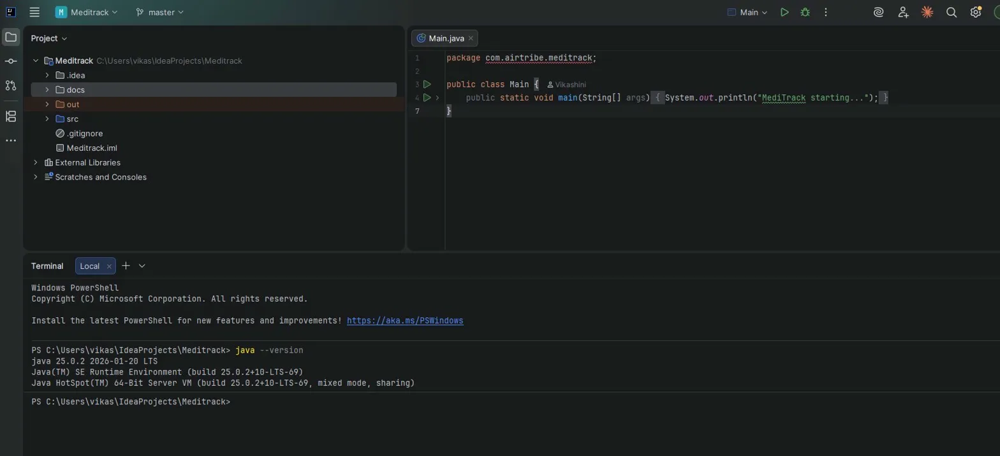
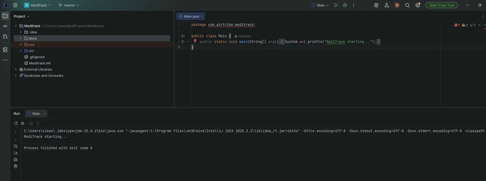

# MediTrack - Setup Instructions

## Prerequisites
- Java JDK 25.0.2
- IntelliJ IDEA

## Installation Steps

### 1. Clone the repository
git clone https://github.com/vikashinikaruppusamyk/MediTrack.git

### 2. Open in IntelliJ
- Open IntelliJ IDEA
- Click File → Open
- Select the cloned MediTrack folder
- 
### 3. Run the project
- Navigate to src/com/airtribe/meditrack/Main.java
- Click the green Run button or press Shift + F10

## Screenshots

